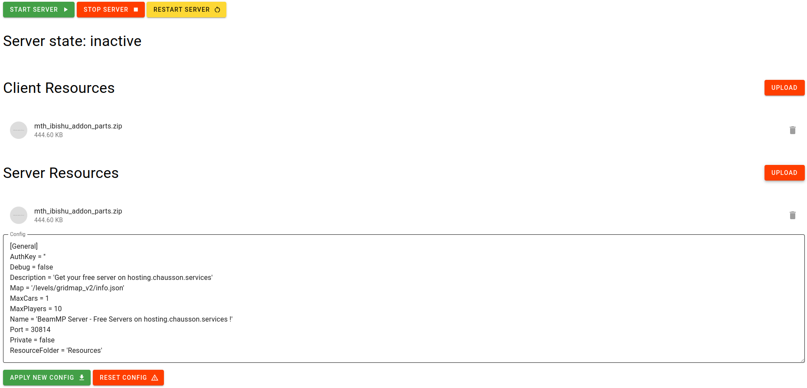

# BeamMP-Manager

This is a simple manager for BeamMP servers.

I have created this in order to go with my [BeamMP Hosting service](https://hosting.chausson.services) I am developping. Feel free to use this on you own server.

## What is looks like right now

## What features are available / TODO:
- [x] Start server
- [x] Stop server
- [x] Restart server
- [x] Upload resources (still needs a progress bar)
- [x] Check server status
- [x] Edit config
- [ ] Update BeamMP server with latest version

## How to install

# 1. Build it yourselft

1. Clone the repository
1. install dependencies with `bun install`
3. Build with `bun run build`
4. Start server with `./build/index.js`

# 2. Download the latest release
Not yet available